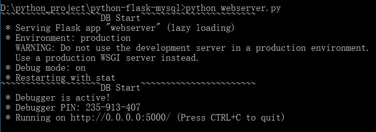

# 基于Python、 flask、 Mysql 搭建一个简单的CMS系统

---

 学习一下python，试试用flask做一个简单的CMS系统框架
 
---

##### 环境

所需组件：

 1. python3.6.5
 2. flask
 3. Python-mysql（这个在windows环境pip安装会报错Microsoft Visual C++ 14.0，安装wordcloud-1.4.1不行的话，就直接下载mysqlclient-1.3.12安装）
 4. Mysql5.5

##### 技术栈

> [flask](http://www.pythondoc.com/flask/index.html)

> [python](https://www.liaoxuefeng.com/wiki/0014316089557264a6b348958f449949df42a6d3a2e542c000)

---
### 截图

---

---

### 目录结构
<pre>
.
├── README.md           
├── webserver.py             // 项目主文件
├── print                    // 项目截图目录
├── models                   // MySQL数据库models目录
│   └── mysql_models.py      // MySQL数据库models
├── templates                // 模板目录
│   └── ***.html
</pre>
